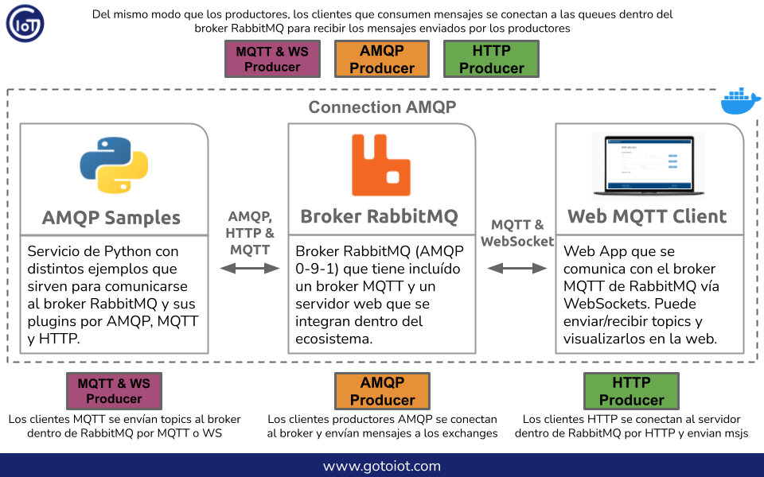
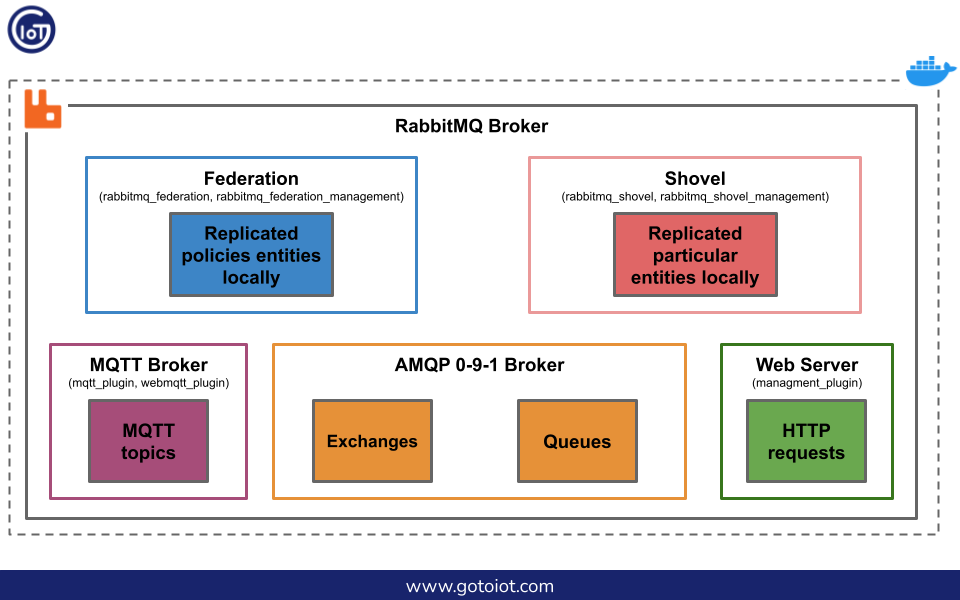
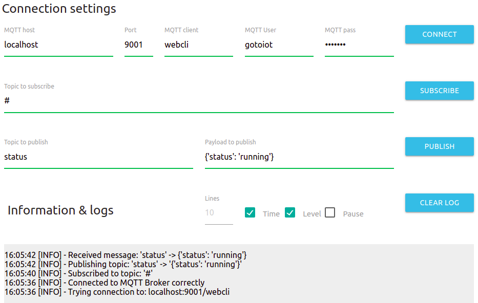

<a href="https://www.gotoiot.com/">
    
</a>

Connection AMQP
===============

*Ayudaría mucho si apoyaras este proyecto con una ⭐ en Github!*

Este proyecto es un ecosistema que posee aplicaciones y servicios que trabajan en conjunto para formar una plataforma integral AMQP. 

Está formado por un broker RabbitMQ que es el corazon del sistema, donde es posible conectar diferentes clientes que producen y consumen mensajes haciendo uso de los exchanges, queues y bindings, propios del protocolo AMQP. Así mismo, el broker de RabbitMQ posee integraciones a modo de plugins que permiten extender e integrar al ecosistema RabbitMQ distintos protocolos, como MQTT, MQTT por WebSockets, HTTP, STOMP y más. Así mismo, cuenta con plugins que permiten intercomunicar brokers entre sí, pudiendo armar clusters, federaciones y reenvío de entidades particulares. Además cuenta con un administrador web que lo hace muy conveniente para configurarlo. 

El broker trae habilitados una serie de plugins que lo hacen muy conveniente para el desarrollo de aplicaciones. Por un lado, con el plugin `rabbitmq_management` se habilita el administrador web del broker y también una interfaz HTTP para realizar las configuraciones mediante su REST API. Con el servicio `rabbitmq_mqtt` y `rabbitmq_web_mqtt` se agrega al broker RabbitMQ un broker MQTT que permite conectar clientes en texto plano, por WebSockets y por SSL. Con los plugin `rabbitmq_federation` y `rabbitmq_federation_management` se habilita dentro del broker la posibilidad de replicar mensajes que se publican en exchanges remotos. Con los plugin `rabbitmq_shovel` y `rabbitmq_shovel_management` es posible tomar datos de un exchange o queue local y replicarlos en un exchange o queue remoto. 

Junto con las características que posee el broker RabbitMQ, en este proyecto se agrega por un lado un servicio en Python que posee ejemplos de muestra para comunicarse con el broker RabbitMQ mediante AMQP y HTTP, así como también un cliente web MQTT que permite comunicarse por WebSockets con el broker MQTT, y que de manera interna es mapeado hacia el broker AMQP. 

Con este ecosistema se tiene una plataforma completa donde es posible integrar todo tipo de servicios y aplicaciones, tanto internas como de terceros, en múltiples lenguajes de programación y en múltiples protocolos. Estas funcionalidades hacen muy conveniente el desarrollo de aplicaciones para IoT. Para que tengas una idea clara, en esta imagen hay un diagrama de como interactuan las partes entre sí.



> Para que entiendas el alcance de este proyecto, es recomendable que leas los artículos de [Introducción a AMQP](https://www.gotoiot.com/pages/articles/amqp_intro/index.html), [Introducción a RabbitMQ](https://www.gotoiot.com/pages/articles/rabbitmq_intro/index.html) y [RabbitMQ Distribuido](https://www.gotoiot.com/pages/articles/rabbitmq_distribuited/index.html) que se encuentran publicados en nuestra web.

> También sería conveniente que leas una [Introducción a MQTT](https://www.gotoiot.com/pages/articles/mqtt_intro/index.html) que se encuentra publicada en nuestra web.

## Comenzando 🚀

Esta sección es una guía con los pasos escenciales para que puedas poner en marcha la aplicación.

<details><summary><b>Mira los pasos necesarios</b></summary>

### Instalar las dependencias

Para correr este proyecto es necesario que instales `Docker` y `Docker Compose`. 

En [este artículo](https://www.gotoiot.com/pages/articles/docker_installation_linux/) publicado en nuestra web están los detalles para instalar Docker y Docker Compose en una máquina Linux. Si querés instalar ambas herramientas en una Raspberry Pi podés seguir [este artículo](https://www.gotoiot.com/pages/articles/rpi_docker_installation) de nuestra web que te muestra todos los pasos necesarios.

En caso que quieras instalar las herramientas en otra plataforma o tengas algún incoveniente, podes leer la documentación oficial de [Docker](https://docs.docker.com/get-docker/) y también la de [Docker Compose](https://docs.docker.com/compose/install/).

Continua con la descarga del código cuando tengas las dependencias instaladas y funcionando.

### Descargar el código

Para descargar el codigo, lo más conveniente es realizar un `fork` de este proyecto a tu cuenta personal haciendo click en [este link](https://github.com/gotoiot/connection-amqp/fork). Una vez que ya tengas el fork a tu cuenta, descargalo desde la terminal con este comando (acordate de poner tu usuario en el link):

```
git clone https://github.com/USER/connection-amqp.git
```

Cuando tengas el código principal, descargá/actualizá los submódulos del proyecto con este comando y continua con la ejecución de la aplicación una vez que descarguen:

```
git submodule update --init --recursive --remote
```

> En caso que no tengas una cuenta en Github podes clonar directamente este repo y descargar los submódulos.

### Ejecutar la aplicación

Lo primero que tenés que hacer para correr la aplicación es compilar los servicios necesarios. Abrí una terminal en la raíz del proyecto y ejecutá este comando para compilar (esta acción puede demorar unos minutos dependiendo tu conexión a internet):

```
docker-compose build amqp-samples
```

Una vez compilado tenés que correr el comando `docker-compose up -d`, que va a descargar la imágen de Docker para el broker RabbitMQ y el cliente web MQTT y luego poner en funcionamiento los servicios en segundo plano. Una vez que se realice el comando espera unos momentos para que el broker realice la configuración inicial. Luego, desde un navegador web ingresa a esta URL [http://localhost:15672/](http://localhost:15672/) para visualizar el panel de administración de RabbitMQ y luego ingresa a [http://localhost:5001/](http://localhost:5001/) para visualizar el cliente Web MQTT (cambia la IP de la URL si la estás corriendo de manera remota). 

Si pudiste acceder al panel de administración y al cliente web significa que la aplicación se encuentra corriendo bien. 

</details>

Continuá explorando el proyecto una vez que lo tengas funcionando.

## Información principal 🔍

En esta sección vas a encontrar la información para entender y configurar el proyecto.

<details><summary><b>Mira los detalles</b></summary>

### Configuración del broker RabbitMQ

RabbitMQ es un broker que implementa la especificación `AMQP 0-9-1`, y además de soportar el comportamiento estándar, posee extensiones a modo plugins donde se pueden interconectar diferentes protocolos como MQTT, MQTT sobre WebSockets, STOMP, HTTP, y otros. Así mismo, cuenta con plugins que permiten intercomunicar brokers entre sí, pudiendo armar clusters, federaciones y reenvío de entidades particulares. Además cuenta con un administrador web que lo hace muy conveniente para configurarlo.

Este servicio tiene habilitados una serie de plugins que lo hacen muy conveniente para el desarrollo de aplicaciones. Por un lado, con el plugin `rabbitmq_management` habilita el administrador web del broker y también una interfaz HTTP para realizar las configuraciones mediante su REST API. Con el servicio `rabbitmq_mqtt` y `rabbitmq_web_mqtt` se agrega al broker RabbitMQ un broker MQTT que permite conectar clientes en texto plano, por WebSockets y por SSL. Con los plugin `rabbitmq_federation` y `rabbitmq_federation_management` se habilita dentro del broker la posibilidad de replicar mensajes que se publican en exchanges remotos. Con los plugin `rabbitmq_shovel` y `rabbitmq_shovel_management` es posible tomar datos de un exchange o queue local y replicarlos en un exchange o queue remoto. 

Para que tengas una idea clara de la configuración del broker, en esta imagen podés ver las funcionalidades que tiene habilitadas.



Si querés saber más detalles podes ir al [README del proyecto](https://github.com/gotoiot/service-amqp-broker). 

### Conectar clientes basados en AMQP Samples

El proyecto `amqp-samples` integrado en este proyecto tiene diferentes códigos de prueba en lenguaje Python para comunicarse con el broker RabbitMQ haciendo uso extensivo de todas las funcionalidades que posee el broker.

Permite producir y consumir mensajes utilizando distintos tipos de exchange - usando el default_exchange, direct_exchanges, fanout_exchanges y topic_exchanges - mediante la biblioteca Pika de Python, como así también crear entidades exchanges, queues y binding, producir y consumir mensajes mediante la interfaz HTTP que provee el plugin `rabbitmq_management`.

Para probar las comunicaciones con diferentes clientes, lo más conveniente es que ejecutes el servicio `amqp-samples` con el comando `docker-compose run amqp-samples` que te va a mostrar en la terminal los códigos de ejemplo soportados y también los comandos que necesitas correr para ejecutar cada uno de ellos.

Si querés saber más detalles podes ir al [README del proyecto](https://github.com/gotoiot/service-amqp-samples). 

### Cofiguración del Web MQTT Client

En el cliente web hay varios campos que tienen valores precargados para que no tengas que escribirlos cada vez.

Modifica los campos que necesites para el broker MQTT dentro de RabbitMQ, ingresa el usuario y la contraseña requeridos (por defecto `gotoiot:gotoiot`) y comenzá presionando `CONNECT`. Después `SUBSCRIBE` para suscribirte a todos los topics (`#`) y una vez que te suscribas presioná `PUBLISH` para producir un `echo` del mensaje enviado. Fijate que en la sección de logs aparecen las acciones que vas realizando.

Para hacer una prueba más completa, podés abrir una nueva instancia del cliente web en otra pestaña del navegador y probar la comunicación publicando topics desde un cliente y recibiendo los mensajes por el otro. 

En la siguiente imagen podés ver una configuración de la herramienta donde se suscribe a un topic y luego se envía, mostrando la información en pantalla.



Si querés saber más detalles podes ir al [README del proyecto](https://github.com/gotoiot/web-mqtt-client). 

### Conectar clientes embebidos MQTT basados en "Embed IoT Core"

Dentro de nuestros proyectos tenemos a [Embed IoT Core](https://github.com/gotoiot/embed-iot-core), que es una plataforma exclusivamente dedicada al desarrollo de aplicaciones embebidas orientadas a IoT. En este proyecto hay aplicaciones de ejemplo para distintos protocolos de comunicación; está optimizado para funcionar en una placa `ESP32` o similar y utiliza la herramienta `PlatformIO` para el manejo de bibliotecas, compilación y descarga del código a la placa y muchas cosas más. 

Si contás con una placa y querés poner en marcha una aplicación embebida para conectarte, te recomendamos que le des una mirada al [README del proyecto](https://github.com/gotoiot/embed-iot-core), que tiene toda la información para que entiendas de qué se trata, cómo descargar el código e instalar las dependencias, y cómo poner en marcha un ejemplo de prueba.

Cuando tengas andando el ejemplo de prueba, podés elegir algunas de las aplicaciones MQTT dentro de la [lista de aplicaciones](https://github.com/gotoiot/embed-iot-core#lista-de-aplicaciones) para conectarte con el broker MQTT.

La info necesaria para configurar y correr las diferentes aplicaciones la vas a encontrar directamente en el README del proyecto, así podés acceder siempre a la información actualizada. 

</details>

## Información complementaria 📚

En esta sección vas a encontrar información que te va a servir para tener un mayor contexto.

<details><summary><b>Lee esta info</b></summary>

### AMQP

AMQP es un protocolo de mensajería que implementa un broker para comunicar aplicaciones/servicios en múltiples lenguajes de programación, tanto propios como de terceros, gracias a la definición de un Mensaje AMQP como lenguaje común para todos.

El protocolo propone la declaración de distintos tipos de exchanges donde los productores envían los mensajes. Así mismo, propone la declaración de queues donde se conectan los consumidores de los mensajes. Finalmente, los binding son reglas que configuran el enrutamiento de los mensajes desde los exchanges hacia las queues. Si querés saber más al respecto podés leer el artículo de [Introducción a AMQP](https://www.gotoiot.com/pages/articles/amqp_intro/index.html) que se encuentra en nuestra web.

### RabbitMQ

RabbitMQ es un broker que implementa la especificación 0-9-1 de AMQP, es muy completo y utilizado, y posee extensiones para personalizar diferentes comportamientos del broker que lo hacen especialmente útil para gran variedad de aplicaciones. Si querés saber más al respecto podés leer el artículo de [Introducción a RabbitMQ](https://www.gotoiot.com/pages/articles/rabbitmq_intro/index.html) que se encuentra en nuestra web.

RabbitMQ tiene diferentes mecanismos para distribuir mensajes entre brokers. Por un lado se puede crear un cluster de brokers y repartir la carga entre los brokers. Por otro lado, la federación permite replicar mensajes desde brokers remotos mediante la configuración de upstreams. Finalmente la funcionalidad shovel permite enviar datos desde un origen a un destino de una manera simple y efectiva. Si querés saber más al respecto podés leer el artículo de [RabbitMQ Distribuido](https://www.gotoiot.com/pages/articles/rabbitmq_distribuited/index.html) que se encuentra en nuestra web.

### El broker MQTT

El broker MQTT es un plugin dentro del ecosistema RabbitMQ que permite conectar distintos clientes MQTT en texto plano, con autenticación y mediante WebSockets. En su configuración por defecto, soporta la conexión por Websockets en el puerto 9001, MQTT en el 1883 y el 8883 para comunicación con autenticación. Se ejecuta dentro del ecosistema RabbitMQ sobre un contenedor de Docker para poder correrlo de igual manera en distintas plataformas. 

### El cliente web MQTT

El cliente web es una `single-page-application` que se comunica con el broker MQTT dentro de RabbitMQ através de WebSockets. Desde acá se pueden publicar y suscribirse a topics, y visualizar los mensajes en tiempo real. El cliente web es accedido a través de un servidor que también se ejecuta sobre un contenedor de Docker. Se encuentra en el directorio **web-mqtt-client** y los detalles sobre cómo funciona los podes ver en el [README del proyecto](https://github.com/gotoiot/web-mqtt-client).

### Ejecución de servicios

Los servicios de la aplicación se ejecutan sobre contenedores de Docker, así se pueden desplegar de igual manera en diferentes plataformas. Los detalles sobre cómo funcionan los servicios los podés ver directamente en el archivo **docker-compose.yml** y complementar la información con el README de cada parte de la app.

</details>

## Tecnologías utilizadas 🛠️

En esta sección podés ver las tecnologías más importantes utilizadas.

<details><summary><b>Mira la lista completa de tecnologías</b></summary><br>

* [Docker](https://www.docker.com/) - Ecosistema que permite la ejecución de contenedores de software.
* [Docker Compose](https://docs.docker.com/compose/) - Herramienta que permite administrar múltiples contenedores de Docker.
* [Material Design](https://material.io/design) - Bibliotecas de estilo responsive para aplicaciones web.
* [Python](https://www.python.org/) - Lenguaje en el que están realizados los servicios.
* [RabbitMQ](https://rabbitmq.com/) - Broker AMQP libre y abierto ampliamente utilizado.

</details>

## Contribuir 🖇️

Si estás interesado en el proyecto y te gustaría sumar fuerzas para que siga creciendo y mejorando, podés abrir un hilo de discusión para charlar tus propuestas en [este link](https://github.com/gotoiot/connection-amqp/issues/new). Así mismo podés leer el archivo [Contribuir.md](https://github.com/gotoiot/gotoiot-doc/wiki/Contribuir) de nuestra Wiki donde están bien explicados los pasos para que puedas enviarnos pull requests.

## Sobre Goto IoT 📖

Goto IoT es una plataforma que publica material y proyectos de código abierto bien documentados junto a una comunidad libre que colabora y promueve el conocimiento sobre IoT entre sus miembros. Acá podés ver los links más importantes:

* **[Sitio web](https://www.gotoiot.com/):** Donde se publican los artículos y proyectos sobre IoT. 
* **[Github de Goto IoT:](https://github.com/gotoiot)** Donde están alojados los proyectos para descargar y utilizar. 
* **[Comunidad de Goto IoT:](https://groups.google.com/g/gotoiot)** Donde los miembros de la comunidad intercambian información e ideas, realizan consultas, solucionan problemas y comparten novedades.
* **[Twitter de Goto IoT:](https://twitter.com/gotoiot)** Donde se publican las novedades del sitio y temas relacionados con IoT.
* **[Wiki de Goto IoT:](https://github.com/gotoiot/doc/wiki)** Donde hay información de desarrollo complementaria para ampliar el contexto.

## Muestas de agradecimiento 🎁

Si te gustó este proyecto y quisieras apoyarlo, cualquiera de estas acciones estaría más que bien para nosotros:

* Apoyar este proyecto con una ⭐ en Github para llegar a más personas.
* Sumarte a [nuestra comunidad](https://groups.google.com/g/gotoiot) abierta y dejar un feedback sobre qué te pareció el proyecto.
* [Seguirnos en twitter](https://github.com/gotoiot/doc/wiki) y dejar algún comentario o like.
* Compartir este proyecto con otras personas.

## Autores 👥

Las colaboraciones principales fueron realizadas por:

* **[Agustin Bassi](https://github.com/agustinBassi)**: Ideación, puesta en marcha y mantenimiento del proyecto.

También podés mirar todas las personas que han participado en la [lista completa de contribuyentes](https://github.com/connection-amqp/contributors).

## Licencia 📄

Este proyecto está bajo Licencia ([MIT](https://choosealicense.com/licenses/mit/)). Podés ver el archivo [LICENSE.md](LICENSE.md) para más detalles sobre el uso de este material.

---

**Copyright © Goto IoT 2021** - [**Website**](https://www.gotoiot.com) - [**Group**](https://groups.google.com/g/gotoiot) - [**Github**](https://www.github.com/gotoiot) - [**Twitter**](https://www.twitter.com/gotoiot) - [**Wiki**](https://github.com/gotoiot/doc/wiki)
